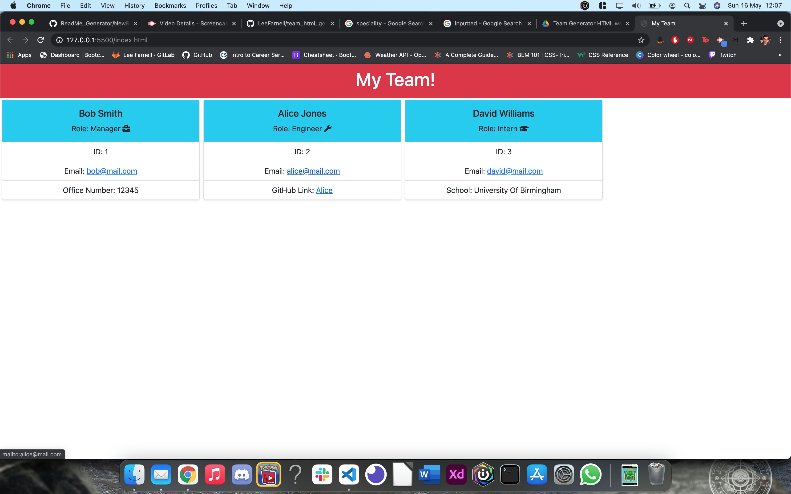
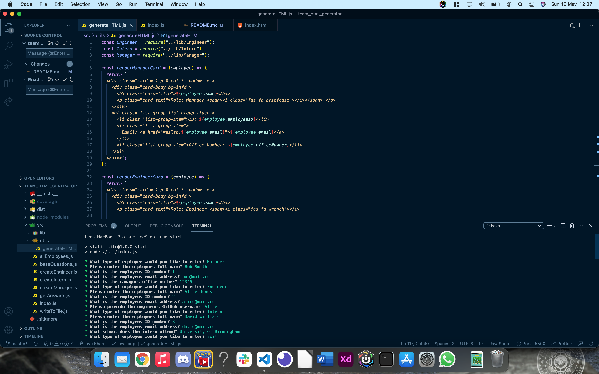
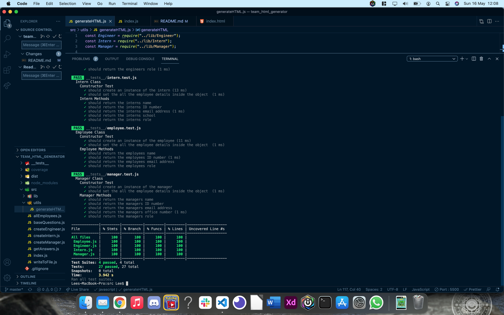

# Team HTML Generator


## Table of Contents

- [Team HTML Generator](#team-html-generator)
  - [Table of Contents](#table-of-contents)
  - [Description](#description)
  - [Installation](#installation)
  - [Usage](#usage)
  - [Licence](#licence)
  - [Video Demonstration](#video-demonstration)
  - [Tests](#tests)
  - [Screenshots](#screenshots)

## Description

For this project, my assignment was to create an application which would use Inquirer.js to create a HTML page for a team of employees. When the app is first run, the user would be given a series of prompts that, when finished, would generate the HTML with all of the user input.

I had to ensure the following criteria was met:

- The user is given the option to enter a Manager, Engineers and Interns.
- Each specific role would come with a speciality question, for example, the manager would need to have an office phone number entered, whist the engineer would need to provide a Github username and the intern would need to provide what school they attend.
- The user can enter multiple engineers and interns.
- Once all the data has been input, an index.html is created, with cards rendered for each of the entered employees.
- Each card would contain the information specific to that employee.
- The email addresses that were provided must be a mailto: link so they are clickable.
- The Github link provided by the engineer would take the user to that GitHub profile.
- Each employee role must be it's own class, and all of those classes needed to be tested in order to show the correct information is being used.

## Installation

```
git clone git@github.com:LeeFarnell/team_html_generator.git
cd team_html_generator
npm install inquirer jest -D
```

## Usage

Use 'npm run start' which will launch the application.

Use 'npm run test' to run the tests for the classes.

## Licence

This content is licenced under the MIT Licence.
https://www.mit.edu/~amini/LICENSE.md

## Video Demonstration

https://drive.google.com/file/d/1IhTsxlRxa9LF06mCjiPrmTOBaPvJRgzn/view

## Tests

All tests were completed with jest. Please ensure jest is installed if you wish to test this app.

## Screenshots





